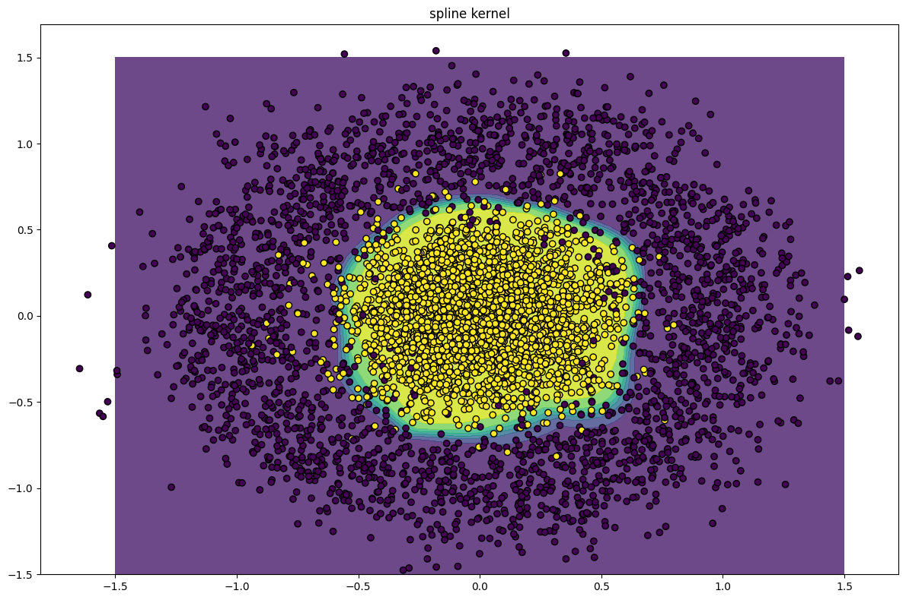
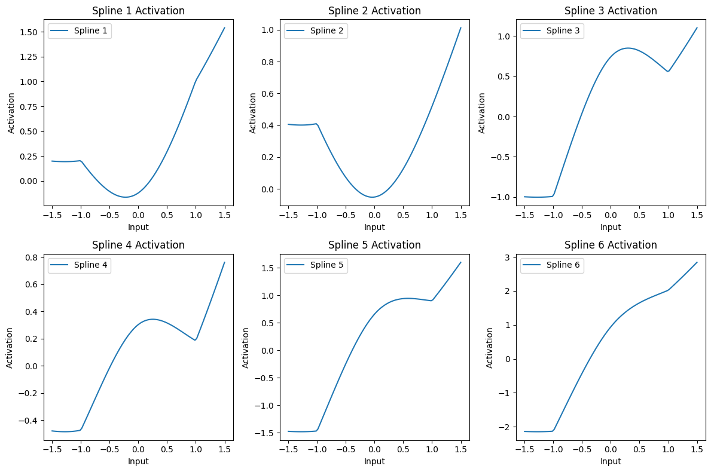

# KAN Toy Experiments

This repository contains experiments with a interpretation of Kolmogorov-Arnold Networks (KANs) using a custom spline kernel.

### Decision Boundaries plot:

## Implementation

The implementation includes:

1. **Spline Activation Function**: A custom activation function using cubic splines.
2. **KAN Model**: A Kolmogorov-Arnold Networks model utilizing the spline activation function.
3. **Training and Evaluation**: Code to train the model on synthetic data, evaluate its performance, and plot the results.

## Spline Activation Function

The spline activation function is implemented using PyTorch. The `SplineActivation` class computes spline values based on a given number of knots.

### Activations plot:

### Jupyter Notebook

You can view and run the experiments interactively in the provided Jupyter Notebook: [kan.ipynb](kan/kan.ipynb)

---

### How to Run

1. Clone the repository

2. Open in the devcontainer

3. Open the [notebook](kan/kan.ipynb)

### Acknowledgments

- [PyTorch](https://pytorch.org/)
- [Matplotlib](https://matplotlib.org/)
- [scikit-learn](https://scikit-learn.org/)
